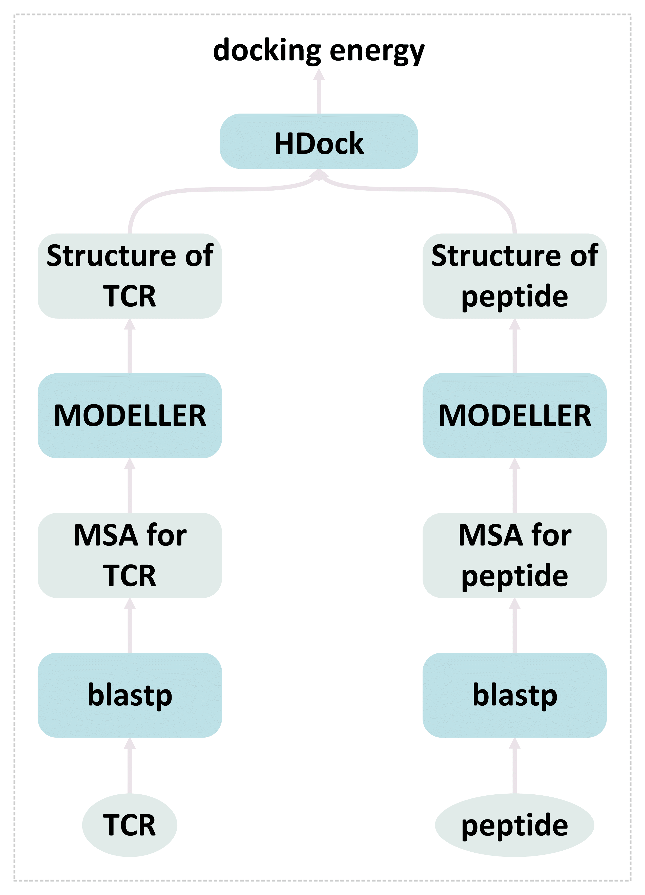

## T-Cell Receptor-Peptide Interaction Prediction with Physical Model Augmented Pseudo-Labeling

The [paper](https://dl.acm.org/doi/10.1145/3534678.3539075) by **[Yiren Jian](https://cs.dartmouth.edu/~yirenjian/)**, **[Erik Kruus](https://www.nec-labs.com/research/machine-learning/people/erik-kruus/)** and **[Martin Renqiang Min](https://www.cs.toronto.edu/~cuty/)** is accepted to ACM SIGKDD (KDD) 2022. The work is done while Yiren doing an internship at **[NEC Labs America](https://www.nec-labs.com/)**.

- [x] [slides](https://www.cs.toronto.edu/~cuty/KDD2022.pdf)
- [x] [paper](https://dl.acm.org/doi/10.1145/3534678.3539075)
- [x] [code](PhyAugmentation/)
- [x] [data](TCR_peptide_docking_energies.txt)


### Overview


In this git repo, we provide the code for building Docking energies (used as pseudo-labels) give sequences of TCRs and peptides.

### Software Requirements

- Install Anaconda and create a environment
```bash
wget https://repo.anaconda.com/archive/Anaconda3-2021.05-Linux-x86_64.sh
bash Anaconda3-2021.05-Linux-x86_64.sh
```
Remember to answer `yes` for appending the PATH to `.bashrc`. Once Anaconda is installed, create a environment for the project and activate it.
```bash
conda create -n PhyAugmentation python=3.7
conda activate PhyAugmentation
```

- Install a standalone blast+ package and blastdb Database
The official guide can be found [here](https://www.ncbi.nlm.nih.gov/books/NBK52640/)
```bash
wget https://ftp.ncbi.nlm.nih.gov/blast/executables/blast+/2.12.0/ncbi-blast-2.12.0+-x64-linux.tar.gz  
tar zxvpf ncbi-blast-2.12.0+-x64-linux.tar.gz
export PATH=$PATH:$HOME/ncbi-blast-2.12.0+/bin
```
Create a blast database
```bash
mkdir $HOME/blastdb
export BLASTDB=$HOME/blastdb
```
Download the PDB amino acids database
```bash
cd $HOME/blastdb
perl $HOME/ncbi-blast-2.12.0+/bin/update_blastdb.pl --passive --decompress pdbaa
```

- Install Biopython as the interface for blast+
```bash
pip install biopython
```

- Install MODELLER
```bash
conda config --add channels salilab
conda install modeller
```
Note that you will need a license file from [MODELLER](https://salilab.org/modeller/download_installation.html).
```
Edit /home/yiren/anaconda3/envs/PhyAugmentation/lib/modeller-10.4/modlib/modeller/config.py
and replace XXXX with your Modeller license key
(or set the KEY_MODELLER environment variable before running 'conda install').
```

- Install Additional Requirements
```bash
pip install wget   #### downloading PDB files
```
If there is still any missing package `ModuleNotFoundError: No module named 'xxx'`, you can simply fix that by `pip install xxx`.

- Standalone HDOCK
You will also need a standalone [hdock](http://hdock.phys.hust.edu.cn/) program in `Tcell-Peptide-PhyAugmentation/PhyAugmentation`.

### Usage
Assuming you have followed the instructions above, you should have the following working directories.
```
$HOME
└───Tcell-Peptide-PhyAugmentation
│   LICENSE
│   README.md
│   TCR_peptide_docking_energies.txt    
│   └───PDB-for-Peptides
│       │   AARAVFLAL.pdb
│       │   ADTLQSIGATTVASN.pdb
│       │   ...
│       │   ...
│       │   YVLTWIVGA.pdb
│   └───PhyAugmentation
│       │   build.py
│       │   clean.py
│       │   hdock
│       │   hdock_example.py
│       │   main.py
│       │   pep_database.pickle
│       │   peptide_build.py
│       │   results.txt
│       │   tcr_unknown.pickle
│   
└───ncbi-blast-2.12.0+
    │   ...
    │   ...
    │   ...
└───blastdb
    │   ...
    │   ...
    │   ...
```

```bash
cd Tcell-Peptide-PhyAugmentation/PhyAugmentation
python main.py 10000    #### try 10000 random TCR-peptide pairs
```
Results are stores in `results.txt`. This is how we generated `Tcell-Peptide-PhyAugmentation/TCR_peptide_docking_energies.txt`. For example:
```
CASSLSTSAVTGELFF VLMGGVPGVE 12.41 8.75 5.09 0.34
CASSRTVYEQYF ALIHHNTYL 19.95 14.07 8.19 0.54
CASPQGQMNTEAFF FLGIYTVTVV 18.59 13.11 7.63 0.50
CASSVGQGSYEQYF ILGGQVVHTV 16.29 11.49 6.69 0.44
CASSYSPSGYDNEQFF RYPLTFGW 21.68 15.29 8.90 0.59
...
...
```
`CASSLSTSAVTGELFF` is TCR sequence, `VLMGGVPGVE` is peptide sequence, and `0.34` is the docking energy at the last step of `hdock`.

### Citations and Related Works

If you find our work helpful, please consider citing our work.
```bibtex
@inproceedings{10.1145/3534678.3539075,
author = {Jian, Yiren and Kruus, Erik and Min, Martin Renqiang},
title = {T-Cell Receptor-Peptide Interaction Prediction with Physical Model Augmented Pseudo-Labeling},
year = {2022},
isbn = {9781450393850},
publisher = {Association for Computing Machinery},
address = {New York, NY, USA},
url = {https://doi.org/10.1145/3534678.3539075},
doi = {10.1145/3534678.3539075},
abstract = {Predicting the interactions between T-cell receptors (TCRs) and peptides is crucial for the development of personalized medicine and targeted vaccine in immunotherapy. Current datasets for training deep learning models of this purpose remain constrained without diverse TCRs and peptides. To combat the data scarcity issue presented in the current datasets, we propose to extend the training dataset by physical modeling of TCR-peptide pairs. Specifically, we compute the docking energies between auxiliary unknown TCR-peptide pairs as surrogate training labels. Then, we use these extended example-label pairs to train our model in a supervised fashion. Finally, we find that the AUC score for the prediction of the model can be further improved by pseudo-labeling of such unknown TCR-peptide pairs (by a trained teacher model), and re-training the model with those pseudo-labeled TCR-peptide pairs. Our proposed method that trains the deep neural network with physical modeling and data-augmented pseudo-labeling improves over baselines in the available two datasets. We also introduce a new dataset that contains over 80,000 unknown TCR-peptide pairs with docking energy scores.},
booktitle = {Proceedings of the 28th ACM SIGKDD Conference on Knowledge Discovery and Data Mining},
pages = {3090–3097},
numpages = {8},
keywords = {pseudo-labeling, T-cell receptors, docking energy, peptide recognition, deep neural network, physical modeling},
location = {Washington DC, USA},
series = {KDD '22}
}
```


Our work is built on several prior works including: [ERGO](https://github.com/IdoSpringer/ERGO) and [HDOCK](http://hdock.phys.hust.edu.cn/).

- Springer, I., Besser, H., Tickotsky-Moskovitz, N., Dvorkin, S., & Louzoun, Y. (2020). Prediction of specific TCR-peptide binding from large dictionaries of TCR-peptide pairs. Frontiers in immunology, 1803.

- Yan, Y., Tao, H., He, J., & Huang, S. Y. (2020). The HDOCK server for integrated protein–protein docking. Nature protocols, 15(5), 1829-1852.
